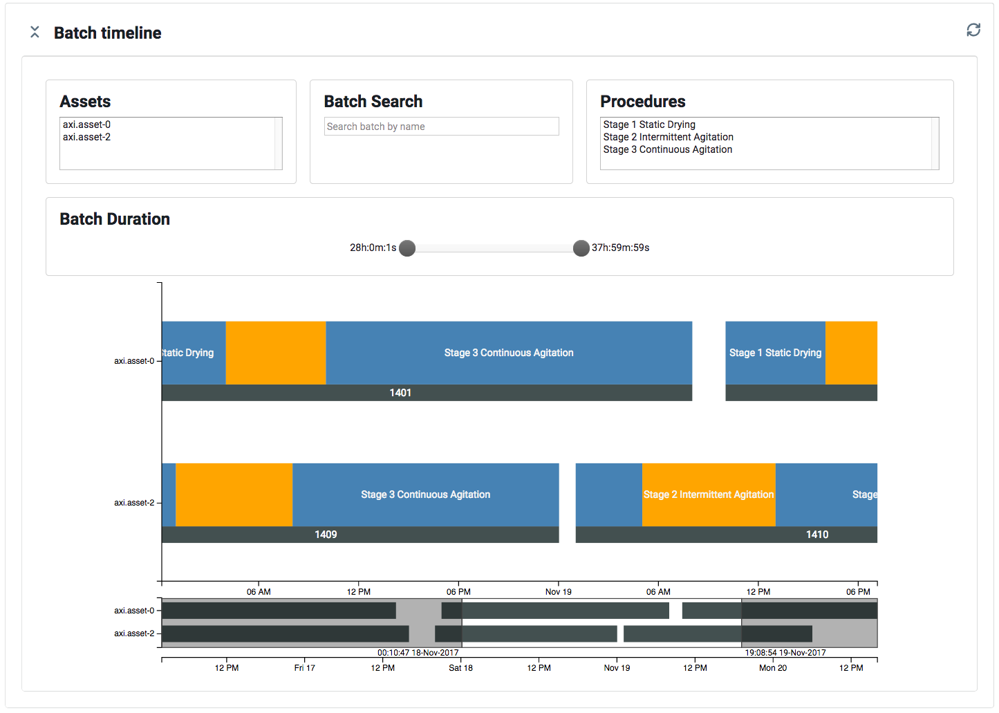

# Batch Viewer


## Overview

The installation process involves copying the Batch Viewer files into the server where ATSD is running. Access to the ATSD server is required to accomplish this task.

## Demo Viewer

A sample demo is available at https://apps.axibase.com/batch/

## Copy Resources

Open a console session with the ATSD server.

Download the Batch Viewer [archive](https://github.com/axibase/batch-viewer/archive/master.zip) and extract it into the `batch` directory.

The final directory structure should look as follows:

```
/opt
  /atsd
    /atsd
      /portal
        /resource
          /batch
            
```

## Insert Sample Data

Open **Data > Data Entry** page.

<!--screenshot with text area ending with last commands in assets.txt -->

Copy contents of the below files one by one into the Commands area and click Send.

- [assets.txt](sample-data/assets.txt)
- [temperature-1.txt](sample-data/temperature-1.txt)
- [temperature-2.txt](sample-data/temperature-2.txt)
- [pressure-1.txt](sample-data/pressure-1.txt)
- [pressure-2.txt](sample-data/pressure-2.txt)

Verify that the Entities tab contains 10 entities `axi.asset-*`.

<!--screenshot-->

Verify that the Metric tab contains metrics `axi.temperature` and `axi.pressure`.

<!--screenshot-->

## Open Viewer

Verify that the batch viewer page is accessible at `https://atsd_host:8443/portal/resource/batch/index.html`.

It should display a set of sites and buildings in the top controls.

<!--screenshot-->

## Introduction

1. Select sites `nur` and `svl` and then select buildings `B` and `C` from top-left control panel. Building `B` is located at site `nur` whereas building `C` is located at site `avl`. 

Use `Ctrl + Click` or `⌘ + Click` to choose multiple options.

2. Once you have some buildings selected, you can view a list of assets (equipments) in the top-right panel. Select `axi.asset-3` and `axi.asset-7`.


3. Scroll down the page. You will see the batch timeline based on batches associated with the selected assets. 

Batch is an interval of time when the equipment was executing a particular manufaturing task. Each batch is composed of multiple procedures, executed sequentially. 

Batches are represented as rectangles, divided into blue and orange segments for every procedure of the batch. Idle time, when the equipment was not busy, is colored with grey color.

The `Assets` selector controls which assets should be shown on the timeline. The `Procedures` selector toggles visibilty of the procedures of the same type. The `Batch Duration` slider filters batches that completed within the specified time range. 

The Batch Search field searches for batches which name contains the specified text. The search is case-insensitive and supports asterisk `'*'` as the wildcard.



4. Click on batches `1440` and `1487` on the timeline and scroll down the page. You will see a time chart consisting of metrics for the selected assets within the interval of time based on selected batches. Metrics for multiple batches will be re-based to a start date in order to illustrate metric values relative to batch start time. 


