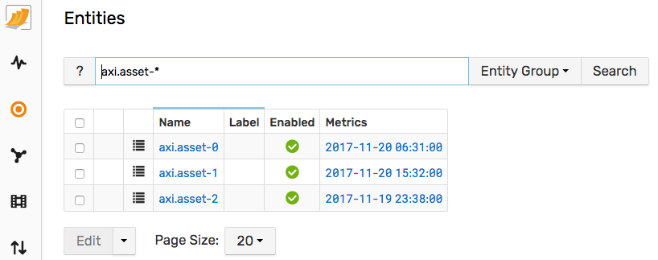
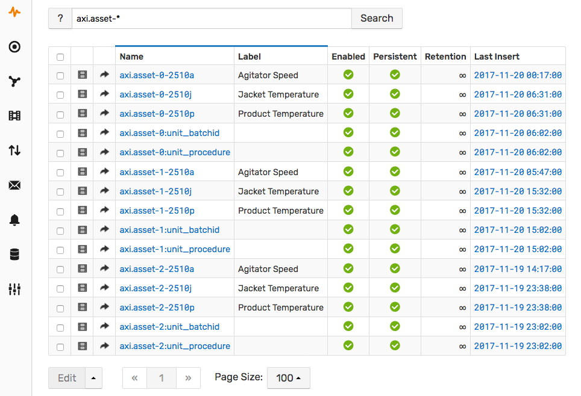
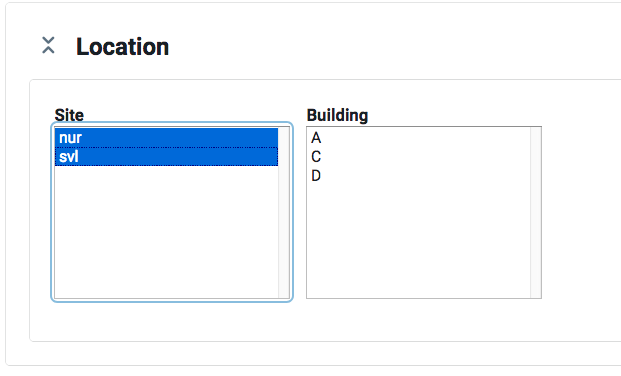

# Batch Viewer


## Overview

The batch viewer provides a visual interface to compare key metrics across multiple assets and manufacturing tasks for the purpose of improving process efficiency and equipment utilization by identifying patterns, trends and outliers.

The installation process involves copying the Batch Viewer files into the server where ATSD is running. Access to the ATSD server console is required to accomplish this task.

## Demo Viewer

Live Batch Viewer demo is available at https://apps.axibase.com/batch/.

## Copy Resources

Open a console session into the ATSD server.

Download the Batch Viewer [archive](https://github.com/axibase/batch-viewer/archive/master.zip) and extract it into the `/opt/atsd/atsd/conf/portal/batch` directory.

```sh
ATSD_HOME=${ATSD_HOME:-/opt/atsd/atsd}
BATCH_DIR=${ATSD_HOME}/conf/portal/batch
mkdir -p $BATCH_DIR
curl -o $BATCH_DIR/master.zip https://codeload.github.com/axibase/batch-viewer/zip/master
unzip $BATCH_DIR/master.zip -d $BATCH_DIR
cp -r $BATCH_DIR/batch-viewer-master/build/* $BATCH_DIR/
rm -r $BATCH_DIR/master.zip $BATCH_DIR/batch-viewer-master
```

The final directory structure should look as follows:

```
/opt
  /atsd
    /atsd
      /conf
        /portal
          /batch
            index.html
            assets
            ...
```

## Insert Sample Data

Open **Data > Data Entry** page.


Copy contents of the below file with sample data into the Commands area and click Send.

- [commands.txt](sample-data/commands.txt)

Verify that the Entities tab contains 3 entities `axi.asset-*`.



Verify that the Metric tab contains metrics `axi.asset-*`.



## Open Viewer

Verify that the batch viewer page is accessible at `https://atsd_host:8443/portal/resource/batch/index.html`

The viewer should display two sites in the top menu.



## Introduction

1. Select sites `nur` and `svl` and then select buildings `B` and `C` from top-left control panel.

  

  Use `Ctrl + Click` or `⌘ + Click` to choose multiple sites and buildings.

2. Once you have some buildings selected, you can view a list of equipments (assets) in the top-right panel. Select `axi.asset-2` and `axi.asset-2`.

  

  Use `Ctrl + Click` or `⌘ + Click` to select multiple assets.

3. Scroll down the page. You will see a scrollable and zoomable timeline containing manufacturing batches for the selected assets. 

  Batch is an interval of time when the equipment was executing an assigned manufacturing task. Each batch is composed of one or multiple procedures, executed sequentially. Batches are represented as rectangles, divided into blue and orange segments for every procedure of the batch. Idle time between procedures is colored with the grey color.

* The `Assets` control contains assets displayed on the timeline. 

* The `Procedures` selector toggles the visibilty of procedures of the same type. 

* The `Batch Duration` slider filters batches that completed within the specified time range. 

* The `Batch Search` field finds batches which name contains the specified text. The match is case-insensitive and supports `'*'` as the wildcard character.

  

4. Click on batches `1401` and `1409` on the timeline and scroll down the page. You will see a time chart consisting of metrics for the selected assets for the interval of time to fit selected batches. Metrics for multiple batches are re-based to a start date in order to illustrate metric values relative to batch start time.

  

5. Click on `Interpolation` to enable time series regularization with the specified period or step function.

  
